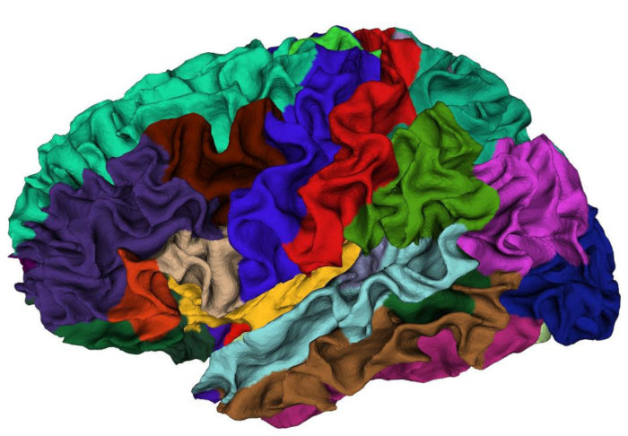
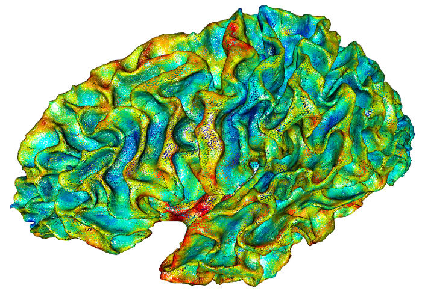
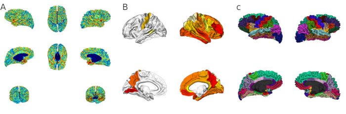
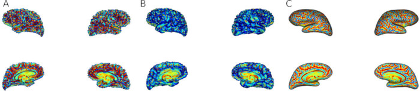

In this document, we demonstrate some high-level functions for loading and analysing structural neuroimaging data preprocessed with [FreeSurfer](https://surfer.nmr.mgh.harvard.edu). FreeSurfer stores its output in a directory structure with fixed subfolder names. This package implements several high-level functions that allow the user to access surface-based brain structure data for large groups of subjects with very little code. It also supports the computation of simple statistics for individual brain structures or brain atlas regions for brain morphometry measures. Statistical analysis can then be performed using standard methods implemented in other packages. The results can be visualized on brain meshes (typically on a template subject like *fsaverage*) in various ways.

Note: While this packages provides an abstract access layer to neuroimaging data, it does *not* implement file readers. It uses the [freesurferformats package](https://github.com/dfsp-spirit/freesurferformats) in the background to parse the file formats.

### Example data used in this document

We will use example data that comes with fsbrain throughout this manual. Feel free to replace the *subjects_dir* and *subjects_list* with data from your study. 

```{r, eval = FALSE}
library("fsbrain");
fsbrain::download_optional_data();
subjects_dir = fsbrain::get_optional_data_filepath("subjects_dir");
subjects_list = c("subject1", "subject2");
subject_id = 'subject1';       # for function which use one subject only
```

Here, we manually defined the list of subjects. Typically, you would read the subjects and associated demographics or clinical data from a CSV file with standard R function like `read.table`, and you would have way more subjects of course.

# Accessing group data

This section explains how to load raw data for groups of subjects from files.

## Morphometry data for groups

Many studies in neuroimaging use morphometry data, i.e., vertex-wise measurements like cortical thickness, volume, brain surface area, etc. These files are generated by FreeSurfer or computed from other data and stored in files like *subject/surf/lh.area* and *rh.area* for the left and right hemisphere, respectively.

Use *group.morph.native()* and *group.morph.standard()* to load morphometry data for groups from morphometry data files (in curv/MGH/MGZ formats). Here is an example that reads the cortical thickness in native space for all subjects of our study:

```{r, eval = FALSE}
groupdata_nat = group.morph.native(subjects_dir, subjects_list, "thickness", "lh");
```

As this is native space data, the data for all subjects have different lengths because the subject's brain meshes have different vertex counts. Therefore, `groupdata` is a named list. Let us determine the number of vertices and the mean cortical thickness of 'subject1':

```{r, eval = FALSE}
subject_id = 'subject1';
cat(sprintf("Subject '%s' has %d vertices and the mean cortical thickness of the left hemi is %f.\n", subject_id, length(groupdata_nat[[subject_id]]), mean(groupdata_nat[[subject_id]])));
# Output: Subject 'subject1' has 149244 vertices and the mean cortical thickness of the left hemi is 2.437466.
```

In the following example, we read standard space data. This data has been mapped to the *fsaverage* template subject. In the process, the data gets smoothed with a filter at various settings. You have to decide which version of the data you are interested in. Here, we want the FWHM 10 data:

```{r, eval = FALSE}
groupdata_std = group.morph.standard(subjects_dir, subjects_list, "thickness", "lh", fwhm="10");
```

The data in standard space has the same number of entries for all subjects:

```{r, eval = FALSE}
cat(sprintf("Data length is %d for subject1, %d for subject2.\n", length(groupdata_std$subject1), length(groupdata_std$subject2)));
# output: Data length is 163842 for subject1, 163842 for subject2.
```


Note that 163842 is the number of vertices of the template subject fsaverage.


## Labels for groups

Use *group.label()* to load label data for groups from files. A label is like a binary mask of vertex numbers, which defines a set of vertices. E.g., all vertices of a certain brain region. In the following examples, we load labels for our group of subjects:

```{r, eval = FALSE}
grouplabels = group.label(subjects_dir, subjects_list, "cortex.label", hemi='lh');
cat(sprintf("The left hemisphere cortex label of subject1 includes %d vertices.\n", length(grouplabels$subject1)));
# output: The left hemisphere cortex label of subject1 includes 140891 vertices.
```


### Labels and masks

You can turn a label (or the combination of several labels) into a mask. A mask for a surface is a logical vector that contains one value for each vertex in the surface. Masks are very convenient for selecting subsets of your data for analysis. Here is an example that first creates a label from a region of an annotation, then it creates a mask from the label. Finally, it modifies the existing mask by adding more vertices from a second region:

```{r, eval = FALSE}
surface = 'white';
hemi = 'both';
atlas = 'aparc';
region = 'bankssts';

# Create a mask from a region of an annotation:
lh_annot = subject.annot(subjects_dir, subject_id, 'lh', atlas);
rh_annot = subject.annot(subjects_dir, subject_id, 'rh', atlas);
lh_label = label.from.annotdata(lh_annot, region);
rh_label = label.from.annotdata(rh_annot, region);
lh_mask = mask.from.labeldata.for.hemi(lh_label, length(lh_annot$vertices));
rh_mask = mask.from.labeldata.for.hemi(rh_label, length(rh_annot$vertices));

# Edit the mask: add the vertices from another region to it:
region2 = 'medialorbitofrontal';
lh_label2 = label.from.annotdata(lh_annot, region2);
rh_label2 = label.from.annotdata(rh_annot, region2);
lh_mask2 = mask.from.labeldata.for.hemi(lh_label2, length(lh_annot$vertices),
  existing_mask = lh_mask);
rh_mask2 = mask.from.labeldata.for.hemi(rh_label2, length(rh_annot$vertices),
  existing_mask = rh_mask);
```


## Annotations for groups

An annotation, also known as a *brain surface parcellatio*n, is the result of applying an *atlas* to a subject. It consists of a set of labels (see above, one for each region) and a colortable.

Use *group.annot()* to load annotation data for groups from files:

```{r, eval = FALSE}
groupannot = group.annot(subjects_dir, subjects_list, 'lh', 'aparc');
cat(sprintf("The left hemi of subject2 has %d vertices, and vertex 10 is in region '%s'.\n", length(groupannot$subject2$vertices), groupannot$subject2$label_names[10]));
# output: The left hemi of subject2 has 149244 vertices, and vertex 10 is in region 'lateraloccipital'.
```

# Aggregating morphometry data

This section explains aggregation functions. These allow you to retrieve the mean, max, min, or whatever value over a number of vertices. Aggregation is supported on hemisphere level and on the level of brain atlas regions.

## Aggregating group data over entire hemispheres

### A single morphometry measure in native space

The fsbrain package provides a high-level interface to access data for groups of subjects. Here, we compute the mean thickness for each subject in native space:

```{r, eval = FALSE}
mean_thickness_lh_native = group.morph.agg.native(subjects_dir, subjects_list, "thickness", "lh", agg_fun=mean);
mean_thickness_lh_native;
# output:
#  subject_id hemi measure_name measure_value
#1   subject1   lh    thickness      2.437466
#2   subject2   lh    thickness      2.437466
```


Note that subject1 and subject2 in the test data are identical (2 is a copy of 1), so we get the same results for both.

### A single morphometry measure in standard space

Here, we compute the mean thickness for each subject in standard space:

```{r, eval = FALSE}
mean_thickness_lh_std = group.morph.agg.standard(subjects_dir, subjects_list, "thickness", "lh", fwhm="10", agg_fun=mean);
mean_thickness_lh_std;
# output:
  subject_id hemi measure_name measure_value
1   subject1   lh    thickness       2.32443
2   subject2   lh    thickness       2.32443
```


### Several measures over several hemispheres in native space

When working with native space data for groups, vertex-wise comparison is not possible and one is often interested in aggregating data or summary statistics. Obtaining these for a group becomes easy with 'fsbrain':


```{r, eval = FALSE}
agg_nat = group.multimorph.agg.native(subjects_dir, subjects_list, c("thickness", "area"), c("lh", "rh"), agg_fun = mean);
head(agg_nat);
# output:
#  subject_id hemi measure_name measure_value
#1   subject1   lh    thickness     2.4374657
#2   subject2   lh    thickness     2.4374657
#3   subject1   lh         area     0.6690556
#4   subject2   lh         area     0.6690556
#5   subject1   rh    thickness     2.4143047
#6   subject2   rh    thickness     2.4143047
```


The measure values are the mean thickness/area/volume over all vertices of the subject, computed from the respective native space morphometry files (e.g., 'subject1/surf/lh.thickness', 'subject2/surf/lh.thickness', and so on).

Note that you can get short format by setting 'cast = FALSE', which will result in a dataframe with the following columns instead:

```{r, eval = FALSE}
agg_nat2 = group.multimorph.agg.native(subjects_dir, subjects_list, c("thickness", "area"), c("lh", "rh"), agg_fun = mean, cast=FALSE);
head(agg_nat2);
# output:
# subject_id lh.thickness   lh.area rh.thickness   rh.area
#1   subject1     2.437466 0.6690556     2.414305 0.6607554
#2   subject2     2.437466 0.6690556     2.414305 0.6607554
```

### Several measures over several hemispheres in standard space

You could do the same in standard space with `group.multimorph.agg.standard()`, even though it's less common as typically vertex-wise analysis is used in standard space. This requires that you pass the `fwhm` parameter to identify which smoothing value you want:

```{r, eval = FALSE}
data_std = group.multimorph.agg.standard(subjects_dir, subjects_list, c("thickness", "area"), c("lh", "rh"), fwhm='10', agg_fun = mean);
head(data_std);
# output:
#  subject_id hemi measure_name measure_value
#1   subject1   lh    thickness     2.3244303
#2   subject2   lh    thickness     2.3244303
#3   subject1   lh         area     0.5699257
#4   subject2   lh         area     0.5699257
#5   subject1   rh    thickness     2.2926377
#6   subject2   rh    thickness     2.2926377
```

Other parameters exist to define the template subject, which defaults to 'fsaverage' in the example above.


## Aggregating over atlas regions

Instead of looking at the full hemispheres, you may want to look at brain regions from some atlas (also called *cortical parcellation*). Examples are the Desikan atlas and the Destrieux atlas, both of which come with FreeSurfer.

### Native space

This is typically done in native space, and here is an example:


```{r, eval = FALSE}
atlas = 'aparc';         # or 'aparc.a2009s', or 'aparc.DKTatlas'.
measure = 'thickness';
region_means_native = group.agg.atlas.native(subjects_dir, subjects_list, measure, "lh", atlas, agg_fun = mean);
head(region_means_native[,1:6]);
# output:
#          subject bankssts caudalanteriorcingulate caudalmiddlefrontal   cuneus entorhinal
#subject1 subject1 2.485596                 2.70373            2.591197 1.986978   3.702725
#subject2 subject2 2.485596                 2.70373            2.591197 1.986978   3.702725
```

We only showed the first 6 columns here.


The measure values are the mean thickness over all vertices of the respective region of the subject, computed from the respective native space morphometry files (e.g., 'subject1/surf/lh.thickness', 'subject2/surf/lh.thickness', and so on). The brain parcellation for the subject is read from its annotation file ( 'subject1/label/lh.aparc.annot' in this case).


### Standard space

You could do the same in standard space with `group.agg.atlas.standard()`, even though it's less common as typically vertex-wise analysis is used in standard space. This requires that you pass the `fwhm` parameter to identify which smoothing value you want, and that you have the template subject in the subjects_dir. The template subject defaults to fsaverage.

```{r, eval = FALSE}
region_means_std = group.agg.atlas.standard(subjects_dir, subjects_list, measure, "lh", atlas, fwhm = '10', agg_fun = mean);
head(region_means_std[1:5]);
# output:
#          subject bankssts caudalanteriorcingulate caudalmiddlefrontal   cuneus
#subject1 subject1 2.583408                2.780666            2.594696 2.018783
#subject2 subject2 2.583408                2.780666            2.594696 2.018783
```

Other parameters exist to define the template subject, which defaults to 'fsaverage' in the example above.


# Working with atlas data


## Creating a label from an atlas region

One can use the *label.from.annotdata()* function on subject level, or the *group.label.from.annot()* function on group level to create a label from a brain parcellation. Here is an example on the subject level:

```{r, eval = FALSE}
surface = 'white';
hemi = 'both';
atlas = 'aparc';
region = 'bankssts';

# Create a label from a region of an annotation or atlas:
lh_annot = subject.annot(subjects_dir, subject_id, 'lh', atlas);
rh_annot = subject.annot(subjects_dir, subject_id, 'rh', atlas);
lh_label = label.from.annotdata(lh_annot, region);
rh_label = label.from.annotdata(rh_annot, region);
```


## Mapping one result value to each brain atlas region

Mapping a single value to an atlas region of a subject (usually a template subject like *fsaverage*) is useful to display results, like p values or effect sizes, on the brain surface.It is common to visualize this on a template subject, like *fsaverage*. We do that for one hemisphere in the next example:


```{r, eval = FALSE}
hemi = "lh"               # 'lh' or 'rh'
atlas = "aparc"           # an atlas, e.g., 'aparc', 'aparc.a2009s', 'aparc.DKTatlas'

# Some directory where we can find fsaverage. This can be omitted if FREESURFER_HOME or SUBJECTS_DIR is set, the function will find fsaverage in there by default. Also see the function download_fsaverage().
template_subjects_dir = "~/software/freesurfer/subjects";    

region_value_list = list("bankssts"=0.9, "precuneus"=0.7, "postcentral"=0.8, "lingual"=0.6);

ret = fsbrain::write.region.values.fsaverage(hemi, atlas, region_value_list, output_file="/tmp/lh_spread.mgz", template_subjects_dir=template_subjects_dir, show_freeview_tip=TRUE);
# output:
# To visualize these region values, try:
#  freeview -f ${FREESURFER_HOME}/subjects/fsaverage/surf/lh.white:overlay=/tmp/lh_spread.mgz:overlay_method=linearopaque:overlay_threshold=0,100,percentile
```

This code will write an MGZ file that can be visualized in FreeView or Matlab/Surfstat. Setting the parameter `show_freeview_tip` to TRUE as in the example will print the command line to visualize the data in FreeView.

The data can also be visualized directly in *fsbrain*, see the section *Visualizing results of region-based analyses* below. The functions listed there can also work with data from both hemispheres at once. See **Figure 3B** for example output.


# Data visualization

This package comes with a range of visualization functions. They are based on OpenGL using the [rgl package](https://CRAN.R-project.org/package=rgl).

## Visualizing different types of data

### Visualizing annotations (brain parcellations based on an atlas)

Let's first visualize an annotation:

```{r, eval = FALSE}
vis.subject.annot(subjects_dir, 'subject1', 'aparc', 'both', views=c('si'));
```


This will give you an interactive window in which you can freely rotate a view similar to the one shown in the following screenshot:



### Visualizing morphometry data

You can also visualize morphometry data:

```{r, eval = FALSE}
vis.subject.morph.native(subjects_dir, 'subject', 'thickness', hemi='both', views=c('si'))
```

You want want to load the data first if you want to do advanced pre-processing or other computations before visualizing it:


```{r, eval = FALSE}
morph_data_lh = subject.morph.native(subjects_dir, 'subject1', 'thickness', 'lh');
morph_data_rh = subject.morph.native(subjects_dir, 'subject1', 'thickness', 'rh');
# Do something with the morph_data here.
vis.data.on.subject(subjects_dir, 'subject1', morph_data_lh, morph_data_rh, views=c('si'));
```





### Visualizing labels

To visualize a label, use the `vis.subject.label` function:

```{r, eval = FALSE}
surface = 'white';
hemi = 'both';
label = 'cortex.label';
vis.subject.label(subjects_dir, subject_id, label, hemi);
```


### Visualizing masks

In the following example, we create a mask by combining several labels and visualize it:

```{r, eval = FALSE}
surface = 'white';
hemi = 'both';
atlas = 'aparc';
region = 'bankssts';

# Create a mask from a region of an annotation:
lh_annot = subject.annot(subjects_dir, subject_id, 'lh', atlas);
rh_annot = subject.annot(subjects_dir, subject_id, 'rh', atlas);
lh_label = label.from.annotdata(lh_annot, region);
rh_label = label.from.annotdata(rh_annot, region);
lh_mask = mask.from.labeldata.for.hemi(lh_label, length(lh_annot$vertices));
rh_mask = mask.from.labeldata.for.hemi(rh_label, length(rh_annot$vertices));

# visualize it
vis.mask.on.subject(subjects_dir, subject_id, lh_mask, rh_mask);
```


### Visualizing results of region-based analyses

The result of a region-based analysis often is one result value (e.g., a p-value or an effect size) per atlas region. In the following example, we visualize such data on the *fsaverage* template subject, but you can use any subject of course.


```{r, eval = FALSE}
atlas = 'aparc';
template_subject = 'fsaverage';
# Some directory where we can find the template_subject. This can be omitted if FREESURFER_HOME or SUBJECTS_DIR is set and the template subject is in one of them. In that case, the function will find fsaverage in there by default. Also see the function download_fsaverage().
template_subjects_dir = "~/software/freesurfer/subjects";    # adapt to your machine


# For the left hemi, we manually set data values for some regions.
lh_region_value_list = list("bankssts"=0.9, "precuneus"=0.7, "postcentral"=0.8, "lingual"=0.6);

# For the right hemisphere, we do something a little bit more complex: first get all atlas region names:
atlas_region_names = get.atlas.region.names(atlas, template_subjects_dir=template_subjects_dir, template_subject=template_subject);
# As mentioned above, if you have fsaverage in your SUBJECTS_DIR or FREESURFER_HOME is set, you could replace the last line with:
#atlas_region_names = get.atlas.region.names(atlas);

# OK, now that we can check all region names. We will now assign a random value to each region:
rh_region_value_list = rnorm(length(atlas_region_names), 3.0, 1.0);         # create 36 random values with mean 3 and stddev 1
names(rh_region_value_list) = atlas_region_names;                           # use the region names we retrieved earlier

# Now we have region_value_lists for both hemispheres. Time to visualize them:
vis.region.values.on.subject(template_subjects_dir, template_subject, atlas, lh_region_value_list, rh_region_value_list);
```

See the help for the `vis.region.values.on.subject` function for more options, including the option to define the default value for the regions which do not appear in the given lists.





## General visualization options

### Different views

You can visualize the data in different views. So far, we have used only the *si* view. The following views are available:

* **si** or *single interactive* view: renders a single instance of the mesh and allows the user to interactively explore the scene (rotate/zoom with the mouse). This view is good for live inspection of data during analysis.
* **sr** or *single rotating* view: renders a single instance of the mesh rotates the camera around the mesh. Can be combined with *rglactions* (see section 'Creating movies' below) to create animated GIF images. This view is good for live inspection of data, and the resulting movies can be used in presentations.
* **t4** or *tiled, 4 angles* view: renders the meshes from four different angles. This kind of view is often used in publications.
* **t8** or *tiled, 8 angles* view: renders the meshes from eight different angles. This kind of view is often used in publications.

To change the view, set the view parameter in any visualization function. You can specify more than one view if needed:


```{r, eval = FALSE}
vis.subject.morph.native(subjects_dir, 'subject', 'thickness', hemi='both', views=c('t4', 't9'))
```

See *Figure 3A* for an example of view *t9* and *Figure 3B* for an example of view *t4*.


### Changing the visualisation surface

By default, the data is visualized on the white surface. For some data, other surfaces may be more apppropriate. You can visualize the data on any FreeSurfer surface you have available. To do this, just set the *surface* parameter in any visualization function. The most commonly used surfaces and *white*, *pial* and *inflated*. Examples:

```{r, eval = FALSE}
vis.subject.morph.native(subjects_dir, 'subject', 'thickness', hemi='both', views=c('si'), surface='inflated')
```

See *Figure 4* for examples for the different surfaces.





### Changing the resolution of figures (or other rgloptions)

The resolution of rgl windows is set in the call to `rgl::par3d`. You can pass arbitrary options to the call by specifying the parameter `rgloptions` when calling any visualization function. Here is an example that increases the resolution of the output window to 800x800 pixels and opens the window at screen position 50, 50:


```{r, eval = FALSE}
rgloptions = list("windowRect"=c(50, 50, 1000, 1000));
vis.subject.morph.native(subjects_dir, 'subject', 'thickness', hemi='both', views=c('si'), rgloptions=rgloptions)
```

See the documentation of rgl::par3d for all available options.

Note that for some OpenGL implementations, it may lead to artifacts or other problems if the window is not fully visible while actions like taking a screenshot or creating a movie are performed. In such a case you may have to adapt the position of the window on the screen (the first 2 parameters of the *windowRect* setting) to make it fully visible if parts of it are off-screen. This also means you should **not** perform other actions on the machine while a movie is being recorded, as taking away the focus from the rgl window or opening other windows on top of it may lead to artifacts.


### Saving screenshots and creating GIF movies (and other rglactions)

The rglactions parameter can be passed to any visualization function to trigger certain actions during the visualization. These are actions like saving a screenshot or a movie or animation in GIF format. Some rglactions only make sense in certain views (e.g., recording a movie only makes sense in animated views, i.e., the *sr* view). Views will silently ignore actions which do not make sense for them.

The following rglactions are available:

* Take a screenshot in PNG format. Key: "**snapshot_png**". Value: string, the path of the output file, including the file extension. Path expansion is performed. Example: `rglactions = list("snapshot_png"="~/fsbrain.png")`. 
* Record a movie. Only handled in rotating views like `sr`. Key: "**movie**". Value: string, the base filename of the movie. The movie will be saved in your home directory, with file extension gif. Example: `rglactions = list("movie"="fsbrain_rotating_brain")`
* Clip the data to remove outliers before visualization. Data smaller than the lower percentile and larger than the upper percentile will be set to the respective percentile value. Required to visualize data with outliers or extreme values, like mean of Gaussian curvature. Key: "**clip_data**". Value: vector of length 2 with the lower and upper percentile. Example: `rglactions = list("clip_data"=c(0.05, 0.95))`

The actions can be combined, e.g., to clip the data and take a screenshot: `rglactions = list("clip_data"=c(0.05, 0.95), "snapshot_png"="~/fsbrain.png")`.

#### Example: Creating a GIF animation (movie)

Here is an example that creates a GIF movie in your HOME directory:

```{r, eval = FALSE}
subjects_dir = fsbrain::get_optional_data_filepath("subjects_dir");
subject_id = 'subject1';
rgloptions=list("windowRect"=c(50, 50, 600, 600));     # the first 2 entries give the position on screen, the rest defines resolution as width, height in px
surface = 'white';
measure = 'thickness';
movie_base_filename = sprintf("fsbrain_%s_%s_%s", subject_id, measure, surface);
rglactions = list("movie"=movie_base_filename, "clip_data"=c(0.05, 0.95));
# Creating a movie requires the rotating view ('sr' for 'single rotating'). The action will be silently ignored in all other views.
vis.subject.morph.native(subjects_dir, subject_id, measure, 'both', views=c('sr'), rgloptions=rgloptions, rglactions=rglactions);
```


The movie will be saved under the name 'fsbrain_subject1_thickness_white.gif' in your home directory. See the [fsbrain project website](https://github.com/dfsp-spirit/fsbrain/blob/master/web/fsbrain_movies.md) for example output movies.

##### Postprocessing the movies

You can tweak the output GIF in whatever external software you like if needed. E.g., if you would like the animation to loop forever, you could use the *convert* command line utility that comes with [ImageMagick](https://imagemagick.org/). Run it from your operating system shell (not within R):

```
convert -loop 0 fsbrain_subject1_thickness_white.gif fsbrain_subject1_thickness_white_loop_inf.gif
```
