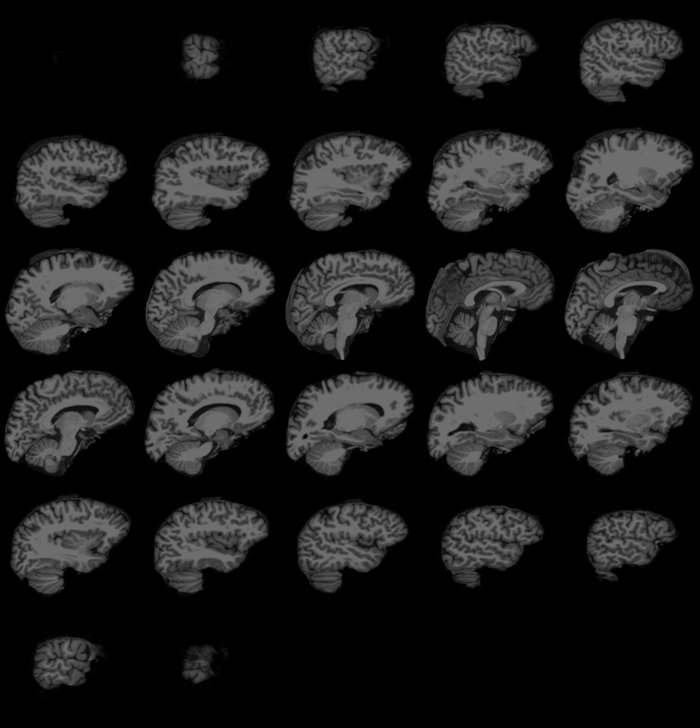

In this document, we demonstrate some high-level functions for loading and visualizing brain volume data. While this package has been developed with  [FreeSurfer](https://surfer.nmr.mgh.harvard.edu) in mind, many of the visualization functions work with 3D matrices and do not make any assumptions on where the data comes from.

Please note that the volume visualization functions presented here are a very recent addition to *fsbrain*, and that they are still in a very early development stage. I am very grateful for any bug reports or comments, please see the [project website](https://github.com/dfsp-spirit/fsbrain).


### Example data used in this document

We will use example data that comes with fsbrain throughout this manual. Feel free to replace the *subjects_dir*, *subjects_list* and *subject_id* with data from your study. 

```{r, eval = FALSE}
library("fsbrain");
fsbrain::download_optional_data();
subjects_dir = fsbrain::get_optional_data_filepath("subjects_dir");
subject_id = 'subject1';       # for function which use one subject only
```

# Loading volume data

If all you want is the raw voxel data, you could load a FreeSurfer volume in MGH or MGZ format like this:


```{r, eval = FALSE}
brain_data = subject.volume(subjects_dir, subject_id, "brain");
```


In many cases, you will need the header information as well, e.g., to be able to compute RAS coordinates for the voxels. If that's the case, load the volume with header:

```{r, eval = FALSE}
brain = subject.volume(subjects_dir, subject_id, "brain", with_header = TRUE);
brain_data = brain$data;
```


# Volume visualization


A brain volume file contains one or more three-dimensional (3D) single channel (grayscale) images, typically encoded as integer arrays representing intensity values at each voxel. A 3D image is sometimes called a *z-stack* of 2D-images, or more general as a collection of 2D image *slices*. The *fsbrain* library offers two different ways to view 3D images: a *lightbox* mode, which shows a grid of several 2D slices, and a true 3D view that renders voxels or meshes computed from them.


An important thing to keep in mind when visualizing volume data is the range of your intensity values. They may be in range 0-255, 0-65535, or 0-1. Most visualization functions expect input values to be normalized to the range 0-1, so you may need to perform a normalization step (see the examples below).


## Lightbox view


Here is an example that loads a brain volume, computes a bounding box, and visualizes some slices along the first axis in lightbox view:

```{r, eval = FALSE}
brain = subject.volume(subjects_dir, subject_id, 'brain') / 255;
bounded_brain = vol.boundary.box(brain, apply=TRUE);
volvis.lightbox(bounded_brain);
```



Have a look at optional arguments to the functions to see how to modify the threshold used when computing the bounding box, how to define which slices are displayed, and how to change the slice axis.

Notice that we scaled the raw data by 255 in this example, as the volume file contains values in the theoretical range 0-255. If none of the voxels actually reaches the max value of 255, you could scale by the actual max value, of course.


## 3D voxel and mesh visualization

These types of visualizations are most suitable for interactive use. They rely on a binary definition of *foreground* (which are rendered) versus *background* voxels (which are not rendered) to show the contents of a 3D image. For most grayscale images, especially pre-processed ones, simple thresholding is enough to identify the foreground. Set the background to `NA` before rendering. In the following example, we load a brain volume with intensity values in range 0-255, and set the voxels with intensity values in range 0-5 as background.

*Notice:* If you do not set anything to background after loading a volume, it may take a long time to render the image and the result will be a single large block.


```{r, eval = FALSE}
brain = subject.volume(subjects_dir, subject_id, 'brain');
threshold = 5L;
brain[which(brain <= threshold, arr.ind = TRUE)] = NA;  # mark background
brain_hull = vol.hull(brain);                           # remove inner triangles, optional but recommended
volvis.voxels(brain_hull);
```


